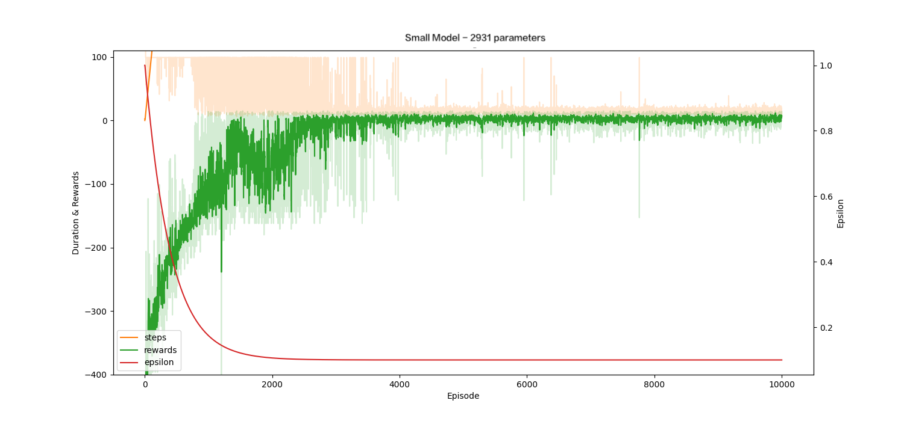
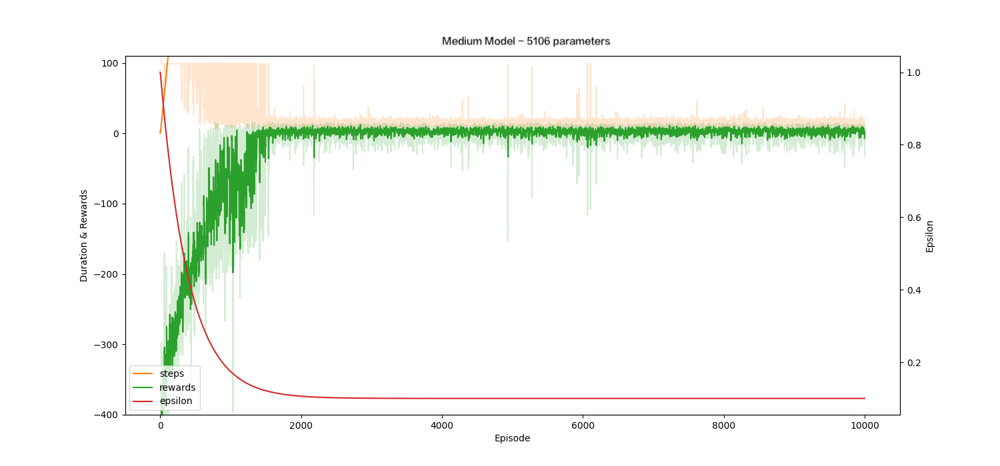
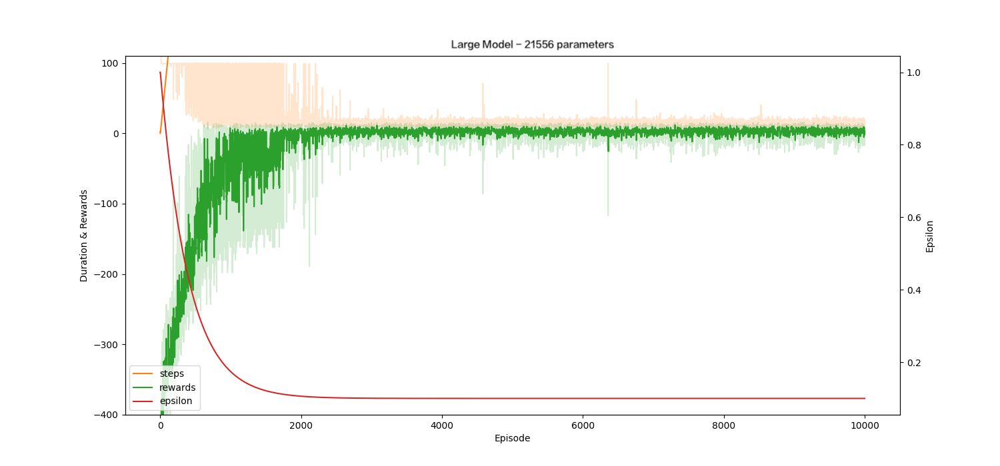

# 安裝步驟

1. create .env檔並輸入
    ```
    NAME = test_1
    LOSS_NAME = Huber
    GYM = Taxi-v3
    EPISODES = 10000
    WARMUP_EPISODE = 10
    EPSILON = 1
    EPSILON_MIN = 0.1
    EPSILON_DECAY = 400
    LR = 0.001
    LR_MIN = 0.0001
    LR_DECAY = 5000
    GAMMA = 0.99
    STATE_NUM = 500
    EMBEDDING_SIZE = 4
    HIDDEN_SIZE = 50
    ACTION_NUM = 6
    MAX_ACTION = 100
    MAX_QUEUE = 50000
    MAX_EPISODE_STEPS = 5000000
    BATCH_SIZE = 128
    UPDATE_RATE = 20
    LOAD_WEIGHT = test_1
    ```

2. 下載以下函示庫
    ```bash
    pip3 install tensorflow
    pip3 install python-dotenv 
    pip3 install tqdm
    pip3 install gym
    pip3 install pygame
    pip3 install matplotlib
    ```

3. 運行程式碼
    ```bash
    python3 train.py
    ```

4. 訓練完後運行遊戲
    ```bash
    python3 play.py
    ```

# 不同模型大小
### 小模型

- 超參數
    
    ```
    EPISODES = 10000
    WARMUP_EPISODE = 10
    EPSILON = 1
    EPSILON_MIN = 0.1
    LR = 0.001
    LR_MIN = 0.0001
    GAMMA = 0.99
    MAX_ACTION = 100
    MAX_QUEUE = 50000
    BATCH_SIZE = 128
    UPDATE_RATE = 20
    ```
    
- 模型參數
    
    ```
    STATE_NUM = 500
    EMBEDDING_SIZE = 4
    HIDDEN_SIZE = 25
    ACTION_NUM = 6
    ```
    
- 模型設計
    
    ```
    Embedding Layer (500, 4)
    		parameter (500 x 4 = 2000)
    Linear Layer (4, 25)
    		parameter (4 x 25 + 25 = 125)
    Linear Layer (25, 25)
    		parameter (25 x 25 + 25 = 650)
    Linear Layer (25, 6)
    		parameter (25 x 6 + 6 = 156)
    
    -------------------------------------
    Total Parameters = 2931
    ```
    
- 訓練結果
    
    
    
    - cost time 3459s
    - 模型不夠大導致variance較大 收斂較慢

---

### 中等模型

- 超參數
    
    ```
    EPISODES = 10000
    WARMUP_EPISODE = 10
    EPSILON = 1
    EPSILON_MIN = 0.1
    LR = 0.001
    LR_MIN = 0.0001
    GAMMA = 0.99
    MAX_ACTION = 100
    MAX_QUEUE = 50000
    BATCH_SIZE = 128
    UPDATE_RATE = 20
    ```
    
- 模型參數
    
    ```
    STATE_NUM = 500
    EMBEDDING_SIZE = 4
    HIDDEN_SIZE = 50
    ACTION_NUM = 6
    ```
    
- 模型設計
    
    ```
    Embedding Layer (500, 4)
    		parameter (500 x 4 = 2000)
    Linear Layer (4, 50)
    		parameter (4 x 50 + 50 = 250)
    Linear Layer (50, 50)
    		parameter (50 x 50 + 50 = 2550)
    Linear Layer (50, 6)
    		parameter (50 x 6 + 6 = 306)
    
    -------------------------------------
    Total Parameters = 5106
    ```
    
- 訓練結果
    
    
    
    - cost  time 2723 s

---

### 大模型

- 超參數
    
    ```
    EPISODES = 10000
    WARMUP_EPISODE = 10
    EPSILON = 1
    EPSILON_MIN = 0.1
    LR = 0.001
    LR_MIN = 0.0001
    GAMMA = 0.99
    MAX_ACTION = 100
    MAX_QUEUE = 50000
    BATCH_SIZE = 128
    UPDATE_RATE = 20
    ```
    
- 模型參數
    
    ```
    STATE_NUM = 500
    EMBEDDING_SIZE = 10
    HIDDEN_SIZE = 100
    ACTION_NUM = 6
    ```
    
- 模型設計
    
    ```
    Embedding Layer (500, 10)
    		parameter (500 x 10 = 5000)
    Linear Layer (10, 100)
    		parameter (10 x 100 + 100 = 1100)
    Linear Layer (100, 100)
    		parameter (100 x 100 + 100 = 10100)
    Linear Layer (100, 50)
    		parameter (100 x 50 + 50 = 5050)
    Linear Layer (50, 6)
    		parameter (50 x 6 + 6 = 306)
    
    -------------------------------------
    Total Parameters = 21556
    ```
    
- 訓練結果
    
    
    
    - cost time 3042 s
    - 較快的收斂 反而可以運算比較少步導致更快

### 三者比較

|  | parameters | cost times | 收斂需要的份數 | 收斂過程的variance |
| --- | --- | --- | --- | --- |
| small | 2931 | 3459 | ~4000 | 大 |
| medium | 5106 | 2723 | ~1700 | 中 |
| large | 21556 | 3042 | ~2000 | 小 |

  

<center class="half">
    
</center>